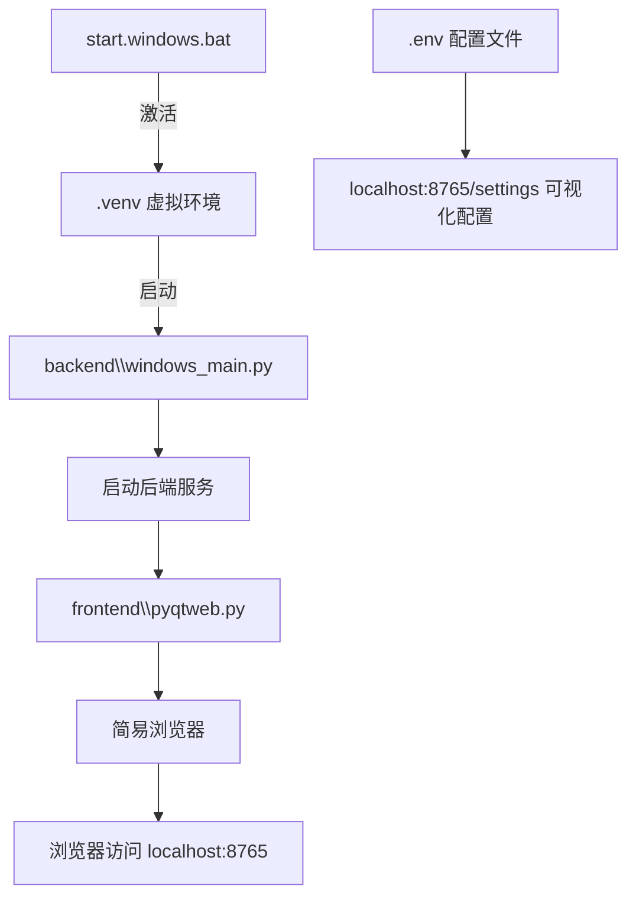
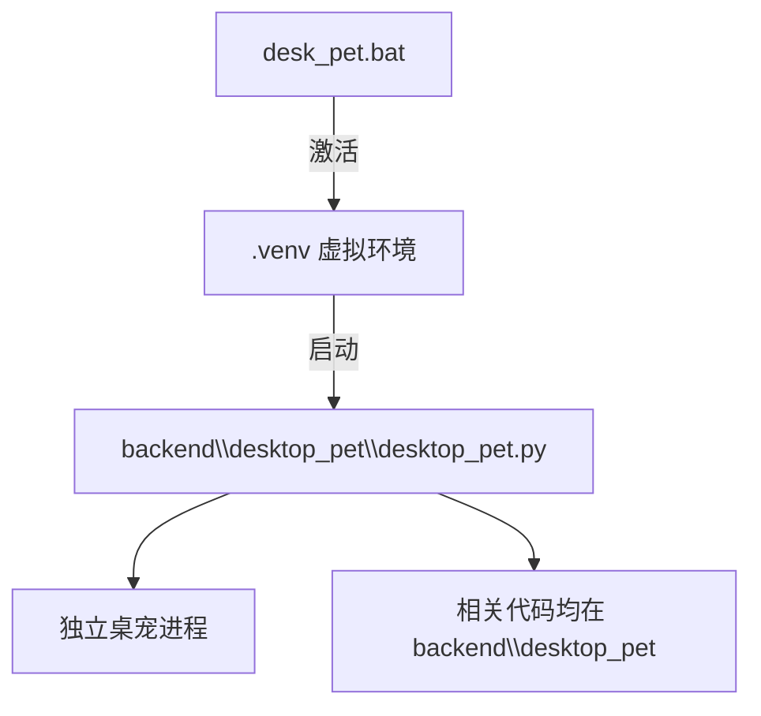
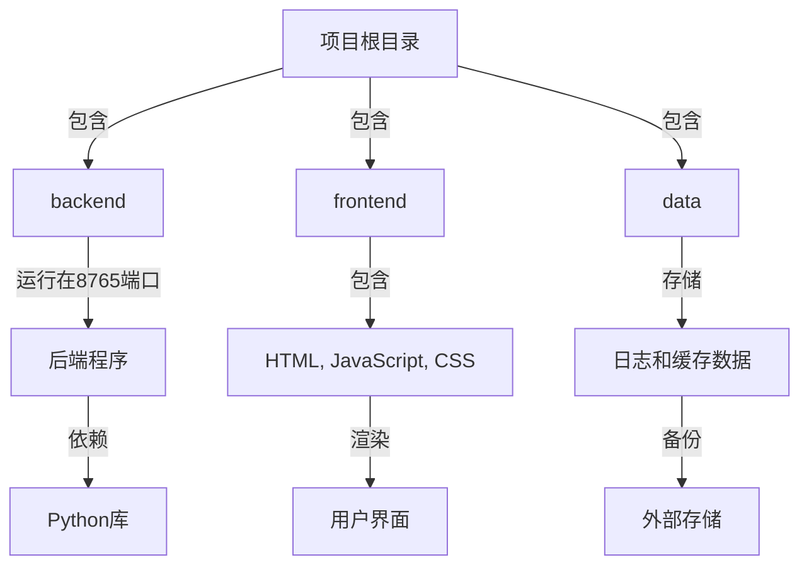
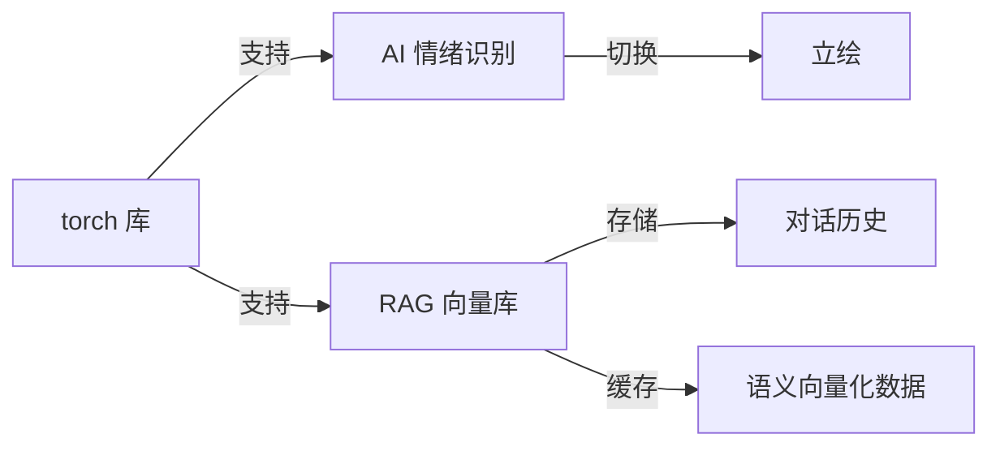

# 前言

## 开发流程

开发者们好捏，以下是一份开发指南： 如果你想为项目做贡献，需要遵循一下提交流程~

### Step1. 功能审核

向github仓库提交自己的issue，然后艾特我查看功能。请在提交issue的时候说明自己想要实现的功能，更改代码的大概范围和实现思路，等待仓库管理员许可后即可开始施工。 

### Step2. 代码审核

等待代码编写完毕后，使用规范的commit，为你更改的每个部分写清楚commit标注。保证代码的简洁和功能，可扩展性，注释只保留必要说明。没必要的更改比如大幅度修改空行这种要避免。fork后向项目pull request，等待管理员审核完毕merge就可以啦~ 注意事项： 我们的开发主要在develop分支，稳定版在main分支，提交务必以develop为主。如果有特殊分支版本功能扩展，会开新分支开发。

## 团队

### 管理员（Collaborators）

钦灵、风雪、Vickko、PL

### 交流群

项目交流群：[798012738](https://qm.qq.com/q/7qMQyizxxm)

---

# 项目结构与实现
## 程序入口

### 主程序

- `backend\\windows_main.py` 是主程序入口，负责启动后端服务（监听 8765 端口）
- 你也可以直接在浏览器访问 `localhost:8765`，体验完整功能。
- 使用根目录下的 `start.windows.bat`，会自动激活 `.venv` 虚拟环境并启动主程序。
- 项目配置集中在 `.env` 文件，访问 `localhost:8765/settings` 可自动读取并生成可视化配置界面

### 桌宠

- `backend\\desktop_pet\\desktop_pet.py` 是桌宠程序的启动入口，运行时会启动一个完全独立于主程序的桌宠进程。
- 所有桌宠相关代码均位于 `backend\\desktop_pet` 目录，便于维护和扩展。
- 使用根目录下的 `desk_pet.bat`，会自动激活 `.venv` 虚拟环境并启动桌宠程序。

## 程序结构

- `backend` 目录包含基于 Python 的后端服务，负责监听 8765 端口。
- `frontend` 目录存放前端资源，包括 HTML、JavaScript 和 CSS 文件。
- `data/logs` 用于存储日志、对话记录及缓存数据。此目录内容可安全删除，但如需备份聊天记录请提前保存。

## 其他相关

### torch 与神经网络库依赖

- 项目采用自训练模型，通过 torch 库识别 AI 当前情绪，实现立绘自动切换。
- 集成 RAG 向量库，实现永久记忆系统：[lingchat简易工程图.docx](../../lingchat%E7%AE%80%E6%98%93%E5%B7%A5%E7%A8%8B%E5%9B%BE.docx)
  - 启用 RAG 后，对话内容以 JSON 格式存储于 `data/rag_chat_history/`。
  - 语义向量化结果缓存在 `data/chroma_db_store/`。注意：缓存不支持自动删除，如需手动修改或清理 `rag_chat_history/`，请同时删除整个 `chroma_db_store/` 文件夹以保证记忆库同步。
- 计算资源需求较低，仅需 torch-cpu，普通 4 代 i3 以上电脑即可流畅运行
